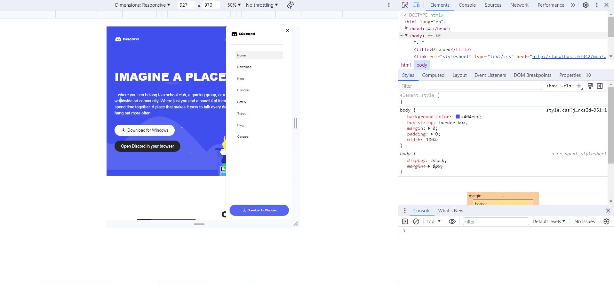

# DevSchool Homework 6

[Visit Website](https://sana23ok.github.io/devschool-hw-6/)

This project is a part of the DevSchool curriculum, specifically Homework 6. The project is hosted on GitHub and can be found here.

## Project Overview
- Use .html and .css files.
- The Design should replicate all elements of the page and states as closely as possible.
- The website should be responsive to all devices.

## Reference

This project was inspired by and references [__Discord__](https://discord.com.).

## Screenshots

